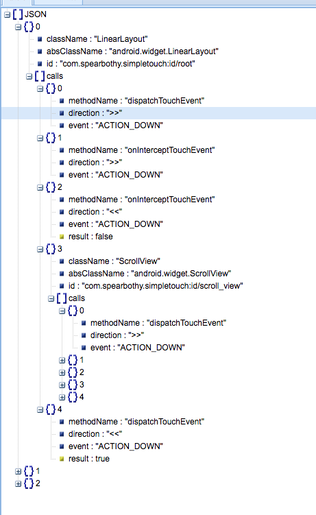

## SimpleTouch 分析


### 目标

> 一个用于监听android事件分发流程的库，两行代码即可在运行时期监听事件的分发流程。


在编写一些复杂的布局时，常常由于事件分发到底是哪个`view`处理产生困扰，做法通常需要经过以下步骤:

- 自定义一个`View`，重写`disaptchTouchEvent`等方法。
- 添加`log`日志。
- 然后替换布局文件。
- 编译，通过控制台查看事件分发流程。
- 继续自定义`View` .... 如果没有发现问题，无线循环...
- 问题解决，删除之前定义的`View`，还原布局文件。

对于如上的流程，需要多次的修改代码，编译等，而且还有还原错误的风险。

那么有没有一种方式，能够在尽可能的少编写代码而实现上述流程，减少对于事件分发打印的困扰呢。


### 简介

`SimpleTouch`为了解决如上问题而诞生，该库可以在运行时期打印完整的事件分发流程。

- 监听`View`的`dispatchTouchEvent`，`onTouchEvent`，`onInterceptTouchEvent`。
- 运行时期动态打印事件分发流程。
- 每一次完整的事件分发记录以`json`的形式写入文件。
- 去重功能，对相同的`move`事件会自动过滤。
- 提供`no-op`版本，使用时可区分`debug`和`release`。
- 提供不同模式显示

对于一次完整的手指点击，控制台打印日志如下：


同时提供以`json`的格式写入到磁盘，偏于细致分析。 (由于暂时没找到合适的流程图软件，暂时以json代替)



该展示效果来源于`bejson`的视图展示功能。


### 使用

**添加依赖**

在项目的`app`下的`build.gradle`中添加依赖

```
debugApi 'com.spearbothy:simple-touch:1.0.3'
releaseApi 'com.spearbothy:simple-touch-no-op:1.0.3'
```

**初始化**


在项目的`Application`的`onCreate()`中调用初始化方法`Touch.inject(this);`

```java
Touch.init(this, new Config().setSimple(false));

```

`Config`对象提供一些配置选项

```java
public class Config {

    // 输出的日志以极简模式输出
    private boolean isSimple = true;
    // 是否延迟打印日志，延迟打印日志会在触摸事件结束之后打印，并且具有去重功能
    private boolean isDelay = true;
    // 是否保留重复的，默认不保留
    private boolean isRepeat = false;
    // 是否写入到文件
    private boolean isPrint2File = true;
}

```

**注入代理类(用于监听事件分发)**

在`Activity`的`onCreate()`的`super.onCreate(savedInstanceState);`之前调用.

```java
  @Override
    protected void onCreate(Bundle savedInstanceState) {
        Touch.inject(this);
        super.onCreate(savedInstanceState);
        setContentView(R.layout.activity_main);
        mRootView = (LinearLayout) findViewById(R.id.root);
    }
```

**使用**

编译完成之后，打开app，开始触摸吧！！！ 每一次手指离开到触摸请间隔大于1s，目的是对于每次触摸加以区分，暂时没想到合适的判断条件。

**备注**

- 提供了`no-op`版本，该版本中包含有初始化和注入方法的空实现，以达到`debug`和`release`使用不同的版本，使`release`不包含任何注入和初始化逻辑。
- 在注入的时候有点耗时，如果页面过于复杂，会有种页面卡顿的感觉.

### 思考

对于该库，其实核心就是怎么能够监听`onTouchEvent()`等事件分发方法。

从实现的角度，核心问题在于两个：

- 如何生成代理类，该代理类中包含对`view`中事件的`hook`。
- 如何将`View`替换为生成的代理类对象。


#### 生成代理类

生成代理类有以下几种方式：

- 静态方式：预先编写一些基本`view`的代理类，而对于自定义`view`，可以在编译期通过`Processor`生成。
- 动态方式：在apk运行时期，动态的生成代理类，该方式参考`java`的动态代理机制。

#### 替换代理类对象

- 静态方式：在程序编译时期，监听xml的打包流程，动态的修改布局文件替换为代理类对象。类似于代码注入。
- 动态方式：在运行时期，构造`view`对象的时候，替换为构造代理类。


根据以上的两种方式，最终全部选择动态的方式，及运行时期动态的生成代理类以及动态的替换`view`对象。


### 实现


#### 生成代理类


`java`本身提供了动态代理的机制，但是由于动态代理的对象必须是接口的方法，而`view`的事件分发方法都不是某一个接口的方法，那么`java`本身的动态代理机制是不行的。

`cglib`是`java`的一个动态代理库，可以代理类方法。但是因为android中是以`dex`方式存储代码，所以无法应用于`android`。

`dexmaker`是应用于`android`的动态生成代码的库。可以用该库实现动态生成代理类。

动态生成代理类的关键点在于`ViewProxyBuilder`类，这里在详细描述，通过该类可以生成代理类对象。

生成的方式如下：

```java
 private static View proxy(final View view, AttributeSet attrs) {
        try {
            return ViewProxyBuilder.forClass(view.getClass())
                    .handler(new TouchHandler())
                    .dexCache(view.getContext().getDir(Constants.DEX_CACHE_DIR, Context.MODE_PRIVATE))
                    .constructorArgTypes(Context.class, AttributeSet.class)
                    .constructorArgValues(view.getContext(), attrs)
                    .addProxyMethod(Arrays.asList(Constants.PROXY_METHODS))
                    .build();
        } catch (IOException e) {
            return null;
        }
    }

```

其中`handler`代表代理方法处理类。

```java
public class TouchHandler implements InvocationHandler {

    @Override
    public Object invoke(Object proxy, Method method, Object[] args) throws Throwable {
        TouchMessageManager.getInstance().printBefore(proxy, method, args);
        Object result = ViewProxyBuilder.callSuper(proxy, method, args);
        TouchMessageManager.getInstance().printAfter(proxy, method, args ,result);
        return result;
    }
}

```

该类实际上只是在方法前和方法后都打印日志

#### 动态替换对象

集成生成了代理对象，还有一个问题就是如何将生成的代理对象和原view`对象替换。

该思路来源于`support-v7`，对于继承`AppCompatActivity`的页面，其中的`TextView`等运行时期都会被替换为`AppCompatTextView`。核心便是`LayoutInfalter`类，该类用于生成所有的布局对象，同时该类提供生成布局对象的`hook`方法，可以添加一下自定义操作。


核心就是调用`LayoutInflater.setFactory()`，关键代码如下：

```java
public static void inject(Context context) {
        if (sConfig == null || !sConfig.isProcess()) {
            return;
        }
        LayoutInflater inflater;
        if (context instanceof Activity) {
            inflater = ((Activity) context).getLayoutInflater();
        } else {
            inflater = LayoutInflater.from(context);
        }
        ViewFactory factory = new ViewFactory();
        if (context instanceof AppCompatActivity) {
            final AppCompatDelegate delegate = ((AppCompatActivity) context).getDelegate();
            factory.setInterceptFactory(new LayoutInflater.Factory2() {
                @Override
                public View onCreateView(String name, Context context, AttributeSet attrs) {
                    return delegate.createView(null, name, context, attrs);
                }

                @Override
                public View onCreateView(View parent, String name, Context context, AttributeSet attrs) {
                    return delegate.createView(parent, name, context, attrs);
                }
            });
        }
        // 设置hook
        inflater.setFactory2(factory);
    }

```

### 引用或借鉴的三方库

- `com.android.support:appcompat-v7`
- `com.google.dexmaker:dexmaker`
- `com.alibaba:fastjson`
- `com.noober.background:core`

### 关于

有任何疑问可以通过`issue`或者以邮件的形式发送到`zziamahao@163.com`


