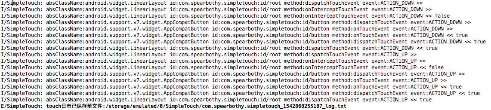

## SimpleTouch

> 一个用于监听android事件分发流程的库，两行代码即可在运行时期监听事件的分发流程。

在编写一些复杂的布局时，常常由于事件分发到底是哪个`view`处理产生困扰，做法通常需要经过以下步骤:

- 自定义一个`View`，重写`disaptchTouchEvent`等方法。
- 添加`log`日志。
- 然后替换布局文件。
- 编译，通过控制台查看事件分发流程。
- 继续自定义`View` .... 如果没有发现问题，无线循环...
- 问题解决，删除之前定义的`View`，还原布局文件。

那么有没有这样的一个库，在运行时期可以动态的查看事件分发流程，不需要自定义`View`，不需要替换布局文件，不需要编写`log`，不需要每次都重新编译呢，基于这个理念，最终诞生了这个库`SimpleTouch`。


`SimpleTouch`能够在运行时期打印所有的事件分发日志，同时提供以每一次手指点击到离开为一个流程，以`json`格式写入到磁盘，便于反复分析。

对于一次完整的手指点击，事件分发的控制台日志如下



### 支持功能

- 监听`View`的`dispatchTouchEvent`，`onTouchEvent`，`onInterceptTouchEvent`。
- 运行时期动态打印事件分发流程。
- 每一次完整的事件分发记录以`json`的形式写入文件。
- 去重功能，对此相同的`move`事件会自动省略。
- 提供`no-op`版本，使用时可区分`debug`和`release`。
- 提供不同模式显示


### 引入

#### 添加依赖

在项目的`app`下的`build.gradle`中添加依赖

```
debugApi 'com.spearbothy:simple-touch:1.0.2'
releaseApi 'com.spearbothy:simple-touch-no-op:1.0.2'
```

#### 初始化

在项目的`Application`的`onCreate()`中调用初始化方法

```java
Touch.init(this, new Config().setSimple(false));

```	

`Config`对象提供一些配置选项

```java
public class Config {

    // 输出的日志以极简模式输出
    private boolean isSimple = true;
    // 是否延迟打印日志，延迟打印日志会在触摸事件结束之后打印，并且具有去重功能
    private boolean isDelay = true;
    // 是否保留重复的，默认不保留
    private boolean isRepeat = false;
    // 是否写入到文件
    private boolean isPrint2File = true;
}

```

#### 注入

在`Activity`的`onCreate()`的`super.onCreate(savedInstanceState);`之前调用.

```java
  @Override
    protected void onCreate(Bundle savedInstanceState) {
        Touch.inject(this);
        super.onCreate(savedInstanceState);
        setContentView(R.layout.activity_main);
        mRootView = (LinearLayout) findViewById(R.id.root);
    }
```


#### 备注

- 提供了`no-op`版本，该版本中包含有初始化和注入方法的空实现，以达到`debug`和`release`使用不同的版本，使`release`不包含任何注入和初始化逻辑。

### 关于

有任何疑问可以通过`issue`或者以邮件的形式发送到`zziamahao@163.com`


