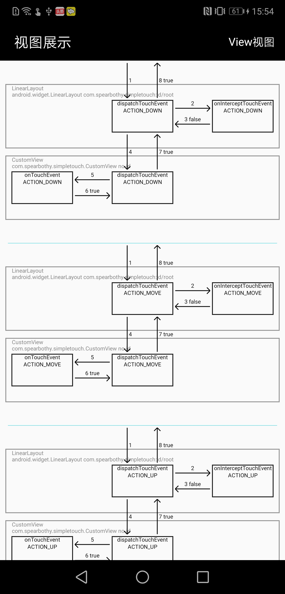
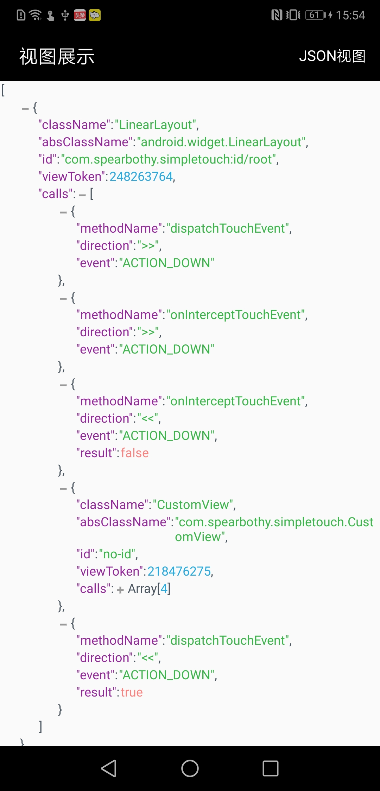
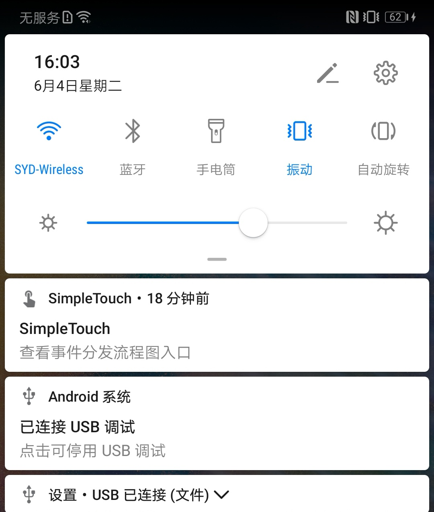

> 一个用于监听android事件分发流程的库，两行代码即可在运行时期监听事件的分发流程。自动打印分发流程，并提供视图查看。


## 重构中 差异点如下：
> 重构方案地址[JVMTI Simple Touch](./library-so/README.md)

原有方案：
- 添加原框架maven依赖，并在activity中调用init方法。
- 在运行时动态生成View的hook dex，在加载到内存中。

新方案：使用JVMTI监听Debug应用的方法回调。

优点：
- 不需要在apk里面添加依赖，即硬编码，通过adb命令即插即用。
- 不生成代理View，减少内存占用

缺点：
- 仅支持Android8.0以上的Debug应用


--- 


### 功能展示


**控制台日志输出**


**图表形式查看**




**JSON格式查看**




### 简介

`SimpleTouch`为了解决事件分发问题而诞生，该库可以在运行时期打印完整的事件分发流程。

- 监听`View`的`dispatchTouchEvent`，`onTouchEvent`，`onInterceptTouchEvent`。
- 运行时期动态打印事件分发流程。
- 每一次完整的事件分发记录以`json`的形式写入文件。
- 去重功能，对相同的`move`事件会自动过滤。
- 提供`no-op`版本，使用时可区分`debug`和`release`。
- 提供不同模式显示


### 使用

**添加依赖**

在项目的`app`下的`build.gradle`中添加依赖

```
debugApi 'com.spearbothy:simple-touch:1.0.7'
releaseApi 'com.spearbothy:simple-touch-no-op:1.0.7'
```

**初始化**


在项目的`Application`的`onCreate()`中调用初始化方法`Touch.inject(this);`

```java
Touch.init(this, new Config().setSimple(false));

```

`Config`对象提供一些配置选项

```java
public class Config {

    // 输出的日志以极简模式输出
    private boolean isSimple = true;
    // 是否延迟打印日志，延迟打印日志会在触摸事件结束之后打印，并且具有去重功能
    private boolean isDelay = true;
    // 是否保留重复的，默认不保留
    private boolean isRepeat = false;
    // 是否写入到文件
    private boolean isPrint2File = true;
    // 是否处理，不处理则不会监听任何方法，任何功能都无法生效
    private boolean isProcess = true;
}

```

**注入代理类(用于监听事件分发)**

在`Activity`的`onCreate()`的`super.onCreate(savedInstanceState);`之前调用.

```java
  @Override
    protected void onCreate(Bundle savedInstanceState) {
        Touch.inject(this);
        super.onCreate(savedInstanceState);
        setContentView(R.layout.activity_main);
        mRootView = (LinearLayout) findViewById(R.id.root);
    }
```

**使用**

编译完成之后，打开app，开始触摸吧！！！ 每一次手指离开到触摸请间隔大于1s，目的是对于每次触摸加以区分，暂时没想到合适的判断条件。

**流程图查看**

下拉通知中可以看到SimpleTouch的入口




**备注**

- 提供了`no-op`版本，该版本中包含有初始化和注入方法的空实现，以达到`debug`和`release`使用不同的版本，使`release`不包含任何注入和初始化逻辑。
- 在注入的时候有点耗时，如果页面过于复杂，会有种页面卡顿的感觉.

### 引用或借鉴的三方库

- `com.android.support:appcompat-v7`
- `com.google.dexmaker:dexmaker`
- `com.alibaba:fastjson`
- `com.noober.background:core`
- `com.yuyh.json:jsonviewer`

### 关于

有任何疑问可以通过`issue`或者以邮件的形式发送到`zziamahao@163.com`


